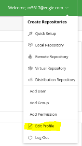
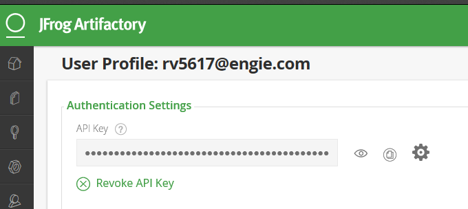
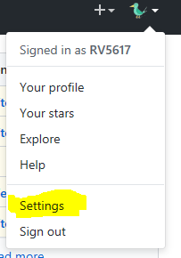
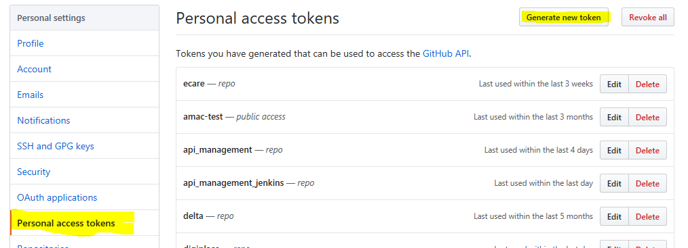
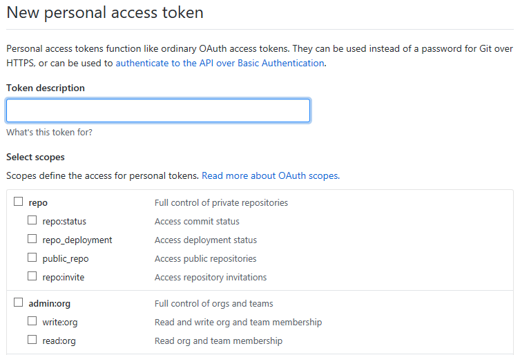
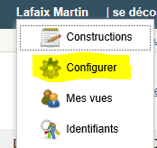
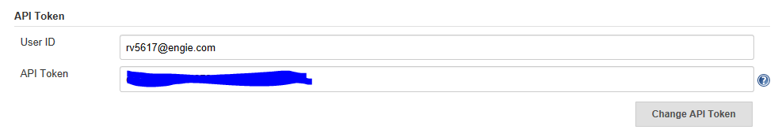
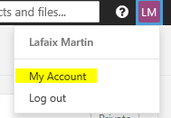
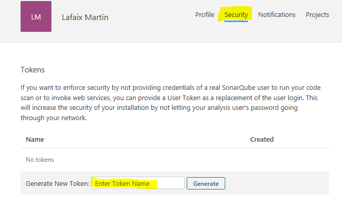

# Installation

## Overview

## Prerequisites

The Zabel Elements package is a Python 3 library. It requires Python 3.6.5 or a later
version.  It is expected to work with newer Python 3 releases too.

The zabel.elements library has one essential external dependency, **requests**.
It also has secondary dependencies, **jira**, **kubernetes**, and **PyYAML**,
depending on the used features.

## Installation

The Platform API is currently available as a PyPI package and as a git repository.

The easiet way to install the current stable release of zabel-elements is to use PyPI:

```bash
pip3 install --upgrade zabel-elements
```

Alternatively, you can clone the package repository:

```bash
git clone https://github.com/engie-group/zabel-elements.git
```

And use `pip3` to install it:

```bash
pip3 install --upgrade .
```

## Credentials Setup

In order to use the library, you need credentials for the tools you intend to use.

Be careful not to store those credentials in a public area (say, GitHub, or a public
S3, or ...).

Please note that the actions allowed depend on your credentials.  The actions you
can perform through the Platform API are those you could perform through the GUI
using the same credentials.

### Tokens Credentials

Some tools use 'simple' token credentials (e.g., a user ID and associated token).

Artifactory, GitHub, Jenkins, and SonarQube are such tools.

Tokens credentials are different from your passwords.  Depending on the tool, they
may be called 'API token', 'token', or something similar.

#### Artifactory

In order to get your Artifactory token, go to your profile page:



And there generate or reuse your API key.  There is only one API key for a given
Artifactory account:



#### GitHub

In order to get a GitHub token, go to your settings page:



And there, in the 'Personal access tokens' section, generate a token.



Then, give it a description, and select the relevant scopes (be sure to select the
relevant scopes, as a token with no associated scopes is quite useless :) ):



#### Jenkins

In order to get your Jenkins API token, go to your settings page:



And there copy or generate or regenerate your token:



#### SonarQube

In order to get your SonarQube token, go to your account page:



There, in the 'Security' tab, generate your new token:



#### SquashTM

In order to get your SquashTM token, you need to connect to SquashTM using the global
admin account.

Go to the administration page, and then to the users page:


Select your account in the list, and click on the 'reset password' link.  This will
by your token (be sure to generate a safe random password).

### OAuth Tokens Credentials

Confluence and Jira may require OAuth tokens.  Cf. the Confluence&Jira Application Link
section below.

## Confluence&Jira Application Link

In order to be able to communicate with Confluence or Jira with OAuth tokens,
an _application link_ may have to be declared on Confluence or Jira.

An application link is a link that allows applications (_your_ code) to access
a Confluence or Jira instance.

### Declaring an Application

In order to declare an application link:

- As a system administrator, go to the Applications page in the JIRA ADMINISTRATION
  area.
- Select 'Applications Links' in the vertical menu.
- Enter a dummy URL (say, <https://automation.example.com>) and press
  'Create new link'.
- In the 'Confirm Application URL' dialog, press 'Continue'.
- Enter an application name (here, `Zabel Automation`), and press 'Continue'.
- The application link will be created. Edit it by clicking on the 'pen' action.
- Go to the 'Incoming Authentication' tab.
- Specify a Customer key (say, `ZABEL_KEY`) and a Customer name (say, `Zabel Automation`,
  it will be the name displayed in the OAuth tokens page).
- Create a new key pair, using the following commands:

```bash
openssl genrsa -out zabel_automation_jira.pem 2048
openssl rsa -pubout -in zabel_automation_jira.pem -out zabel_automation_jira.pub
```

- In the 'Public key' area, enter the generated public key (you may include the
  `---BEGIN PUBLIC KEY---` and `---END PUBLIC KEY---` part).
- Press 'Save' (you may have to scroll down).
- Press 'Close'

That's it.

!!! note
    If you do not have administrator rights on the Confluence (or Jira) instance,
    please contact your administration team, providing them with a public key (keep
    the private key private).

### OAuth Authentication

Once an application has been declared, an OAuth token has to be generated (or more than
one token, an application is not limited to one user).

A token generator is available (`oauth_token_generator.py`) in the
<https://github.tools.digital.engie.com/GBSEngieDigitalWalnut/tools-scripts-misc>
repository.

This script is in Python 3. It requires two external libraries, **tlslite-ng** and
**oauth2**.  (It will work with the legacy **tlslite** library, but please note that
the **tlslite** library is not supported for Python 3.7 and higher.)

This script is interactive: it provides a link, that has to be accessed in a 10-minute
gap, that will validate it and create the final token.  The generated token will have
the rights of the acknowledging user.

It takes the following parameters:

- `tool` (confluence or jira, or their uat variants confluence.uat or jira.uat)
- `consumer_key`
- `private_key_file`

#### Usage

```bash
python3 oauth_token_generator.py confluence ZABEL_KEY zabel_confluence.pem
```

Any user can acknowledge a token (which will provide its rights only), and there can be
many simultaneously defined tokens.

Please note that if you remove the application link, all corresponding oauth tokens will
be removed too.

### Further Reading

<https://developer.atlassian.com/cloud/jira/platform/jira-rest-api-oauth-authentication/>
